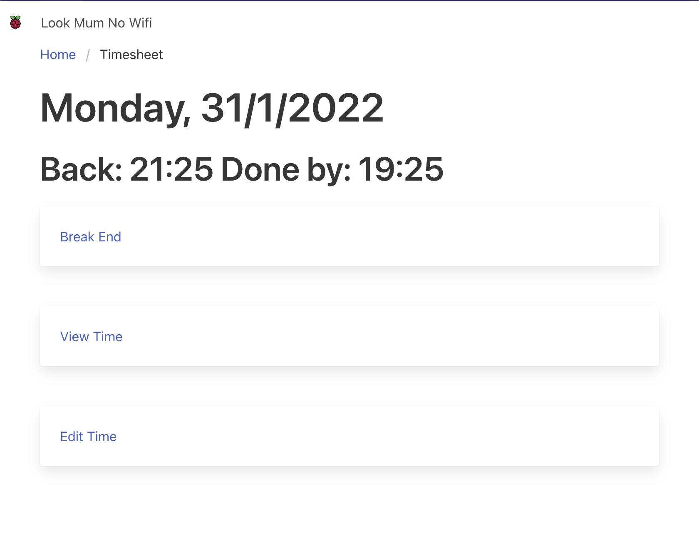
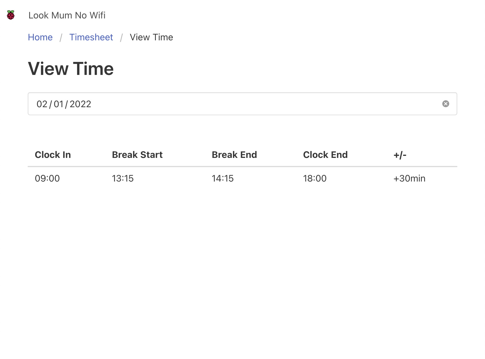
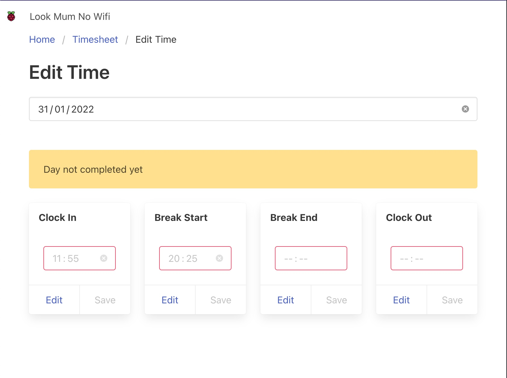

# piserver

Setup for my home Raspberry Pi

Contains the following applications:

- Custom Dashboard application
- Postgres
- Castblock
- Filebrowser
- Plex
- Pihole
- Portainer

---

## Dashboard Features

### Timesheet

This feature has been designed to aid time tracking when working from home. Personally, I struggle to keep track of time and know that I have worked several hours of overtime without asking for compensation for a variety of reasons. This feature allows me to keep track of my work-hours without
exposing actual timings to an overcomplicated third party platform.

It is designed for 7.5h work days (not accounting for breaks) with a single lunch break taken. It displays the projected finishing time, keeping track of break timings and showing when the workday will be completed if a shorter break is taken.

You can also look at previous time entries to check any overtime, or time owed to the employer which is especially useful if you have a flexitime scheme in place.

If you forget to clock in an activity, you can also go back retrospectively and edit your records.

|                          View Time Screen                          |                          Edit Time Screen                          |
| :----------------------------------------------------------------: | :----------------------------------------------------------------: |
|  |  |

#### Security Disclaimer

When you navigate to `/timesheet` for the first time and your IP address is not recognised yet, you will be prompted to select a user, and that entry is written to the database. IP addresses can be spoofed, don't deploy this code in an exposed environment, or where you don't trust your users.
In its current design, it is designed for my partner and myself.
